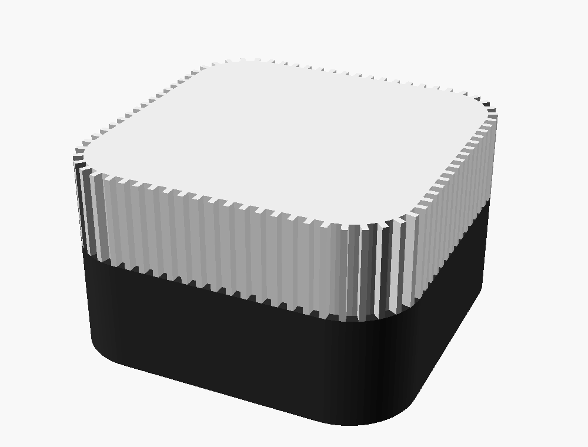
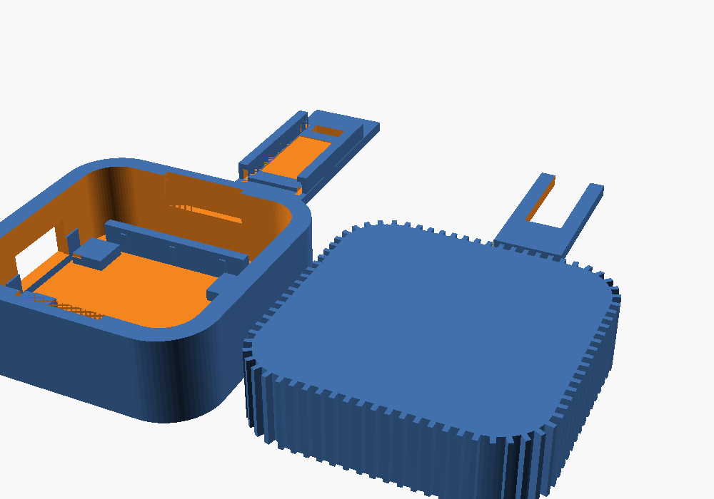

# cc-reminder-esp8266

Đèn báo trạng thái Claude Code, chạy trên Wemos D1 Mini (ESP8266) + WS2812.
Kèm vỏ in 3D tham số hoá.

Port từ [Curlyfuu/cc_reminder](https://github.com/Curlyfuu/cc_reminder) — bản
gốc dùng ESP32-C3 + BLE. ESP8266 không có Bluetooth nên bản này chuyển sang
WiFi/HTTP, và hoá ra lại nhanh hơn: mỗi hook mất ~50ms thay vì 1–3 giây scan BLE.
Đổi lại, đèn cắm nguồn USB ở đâu cũng được, không cần ở gần máy tính.



| Màu | Trạng thái | Khi nào |
|---|---|---|
| Xanh lá, sáng đứng | `IDLE` | Claude Code rảnh |
| Vàng cam, đập chậm | `WORKING` | đang chạy |
| Đỏ, đập nhanh | `INTERACT` | đang xin xác nhận quyền |

## Phần cứng

| Món | Ghi chú |
|---|---|
| Wemos D1 Mini (ESP8266) | |
| 1 LED WS2812B | cắt ra từ dây strip |
| 3 sợi dây 26–28 AWG | dây nhiều sợi mảnh, đừng dùng dây đơn cứng |

### Đấu nối

| Strip | D1 Mini |
|---|---|
| VCC (5V) | **3V3** |
| DIN | **D9 / RX (GPIO3)** |
| GND | G |

Hai điểm dễ sai:

**GPIO3 là bắt buộc.** Thư viện `NeoPixelBus` chỉ chạy được DMA trên chân này.
Nếu dùng bit-bang (`Adafruit_NeoPixel`) thì WiFi interrupt sẽ cắt ngang làm sai
timing → LED nhảy màu ngẫu nhiên. Đây là lỗi kinh điển của combo
ESP8266 + WS2812 + WiFi.

**Cấp nguồn từ 3V3, không phải 5V.** Ngưỡng HIGH của WS2812 là 0.7 × Vdd. Ở
3.3V thì ngưỡng chỉ ~2.3V, khớp thoải mái với mức GPIO. Nếu cấp 5V thì ngưỡng
lên 3.5V, cao hơn mức GPIO xuất ra — chạy được nhưng không ổn định. Với 1 LED
thì 3V3 dư sức.

Nếu dùng nhiều LED và buộc phải cấp 5V: mắc 1 diode 1N4148 nối tiếp trên dây
nguồn, sụt 0.6V xuống ~4.4V để hạ ngưỡng về ~3.1V.

## Cài đặt

### 1. Test LED trước

```bash
cd test
pio run -t upload && pio device monitor
```

Phải thấy đỏ → xanh lá → xanh dương → trắng. Nếu đỏ và xanh lá đổi chỗ nhau,
sửa `NeoGrbFeature` thành `NeoRgbFeature`.

### 2. Nạp firmware

```bash
cd firmware
pio run -t upload
```

Không cần sửa code — WiFi cấu hình qua trang web, xem mục bên dưới.

Kiểm tra: `curl http://cc-reminder.local/api/status`

### 3. Cấu hình hook Claude Code

Chép `host/settings.example.json` vào `~/.claude/settings.json`, sửa đường dẫn.
Kiểm tra bằng `/hooks` trong Claude Code — menu đó liệt kê mọi hook đang có và
cho biết nó đến từ file settings nào.

| Event | Trạng thái | Tại sao chọn event này |
|---|---|---|
| `SessionStart` | IDLE | đặt lại đèn khi mở session |
| `UserPromptSubmit` | WORKING | bắn ngay khi bạn gửi prompt |
| `Notification` | INTERACT | matcher `permission_prompt\|idle_prompt\|agent_needs_input` |
| `Stop` | IDLE | Claude trả lời xong |
| `SessionEnd` | IDLE | đóng session |

**Vì sao `Notification` mà không phải `PermissionRequest`.** Cả hai đều có thật.
Nhưng `PermissionRequest` bắn mỗi khi có quyết định về quyền, kể cả những lần
được rule tự cho qua mà không hỏi bạn — đèn sẽ nháy đỏ vô ích.
`Notification` với matcher trên chỉ bắn khi Claude **thật sự đang chờ bạn**, và
bắt thêm cả trường hợp đứng chờ mà không phải xin quyền (`idle_prompt`), đúng
là lúc bạn cần đèn báo nhất. Muốn dùng `PermissionRequest` thì cũng được, thêm
song song vào cũng không sao.

**Mọi hook đều `async: true`.** Hook chạy nền, không chặn session. Nếu không có
cờ này, `UserPromptSubmit` sẽ chặn Claude xử lý prompt cho tới khi hook xong —
mà bước dò IP lần đầu có thể mất ~1 giây.

**Dùng exec form (`command` + `args`).** Mỗi phần tử `args` được truyền thành
đúng một tham số, không qua shell, nên đường dẫn có dấu cách cũng không sao.

### Vì sao script luôn exit 0

Đây không phải chi tiết nhỏ. Trong Claude Code, exit code 2 của hook có nghĩa
khác nhau tùy event, và với các event mình dùng thì rất tệ:

| Event | Exit 2 gây ra |
|---|---|
| `UserPromptSubmit` | **chặn prompt và xoá nó khỏi context** |
| `Stop` | **ngăn Claude dừng, bắt nó tiếp tục** |

Nghĩa là một cái đèn LED rút phích có thể làm treo phiên làm việc của bạn.
Script bắt mọi exception và luôn trả về 0, kể cả khi không tìm thấy thiết bị.

### Vì sao script không in ra stdout

Với `UserPromptSubmit`, Claude Code lấy stdout của hook làm **context cho
Claude đọc**. Nên script chỉ in khi bạn gọi tay (`STATUS`, `discover`); lúc đổi
trạng thái nó im lặng hoàn toàn. Muốn xem log thì đặt `CC_REMINDER_DEBUG=1`,
log đi ra stderr.

Tài liệu hook: https://code.claude.com/docs/en/hooks

## Trang web cấu hình

Firmware trong `firmware/` có trang web cấu hình, **không cần sửa code hay nạp
lại để đổi WiFi hoặc màu đèn**. Cấu hình lưu trong EEPROM.

### Lần đầu

1. Nạp firmware, cấp nguồn
2. Đèn **đập xanh dương** = đang ở chế độ AP, chờ cấu hình
3. Kết nối WiFi `cc-reminder-setup` (mở, không mật khẩu)
4. Mở `http://192.168.4.1` — điện thoại thường tự bung trang lên nhờ captive portal
5. Bấm **Quét**, điền tối đa 3 mạng WiFi, bấm **Lưu & khởi động lại**

Sau đó vào `http://cc-reminder.local` (hoặc IP) để cấu hình tiếp.

Nếu không mạng nào trong danh sách khả dụng, thiết bị quay về chế độ AP.

### Cấu hình được gì

| | Ghi chú |
|---|---|
| Độ sáng | 1–255, áp dụng ngay |
| Số LED | 1–24, cần khởi động lại |
| Thứ tự màu | GRB / RGB — sửa lỗi "đỏ ra xanh lá" ngay từ web, khỏi nạp lại |
| Màu từng trạng thái | color picker cho IDLE / WORKING / INTERACT |
| Nhịp đập | bật/tắt và chu kỳ riêng cho từng trạng thái |
| Ambient | thời gian chờ, hiệu ứng, tốc độ, độ sáng riêng, màu |
| 3 mạng WiFi | nhà / công ty / hotspot, cần khởi động lại |
| Hostname | cần khởi động lại |

Có sẵn 3 nút thử IDLE / WORKING / INTERACT để xem màu ngay trên đèn thật, và
nút xoá cấu hình về mặc định.

Mật khẩu WiFi **không bao giờ được gửi về trình duyệt**. Để trống ô mật khẩu
khi lưu thì mật khẩu cũ được giữ nguyên.

### Sửa trang web

HTML nằm ở `firmware/web/page.html`, được nhúng vào PROGMEM trong `main.cpp`.
Sau khi sửa HTML:

```bash
python3 tools/embed_page.py
```

Script chỉ thay phần giữa 2 marker `PAGE BEGIN` / `PAGE END`, không đụng vào
code còn lại. Đừng sửa HTML trực tiếp trong `main.cpp` — lần chạy script sau
sẽ ghi đè.

### API

| Endpoint | |
|---|---|
| `GET /` | trang cấu hình |
| `GET /state?s=IDLE\|WORKING\|INTERACT` | đổi trạng thái (dùng cho hook) |
| `GET /status` | tên trạng thái, dạng text |
| `GET /api/status` | JSON: state, ap, slot, ssid, ip, rssi, uptime, heap |
| UDP `:45678` gửi `CCR?` | trả về JSON có IP — dùng để dò thiết bị |
| `GET /api/config` | JSON cấu hình hiện tại (không có mật khẩu) |
| `POST /api/config` | lưu cấu hình, form-urlencoded |
| `GET /api/scan` | quét WiFi |
| `POST /api/preview?fx=N` | xem thử hiệu ứng 15s, không lưu |
| `POST /api/reboot`, `POST /api/reset` | khởi động lại / xoá cấu hình |

`/state` và `/status` giữ nguyên như bản cũ nên `host/cc_reminder_http.py`
không phải sửa gì.

### firmware-minimal

`firmware-minimal/` là bản đơn giản: WiFi hardcode trong `config.h`, không có
trang web. Nhẹ hơn, ít thứ có thể sai hơn. Dùng nếu bạn không cần cấu hình
qua web.

## Ambient — IDLE lâu thì bật hiệu ứng

IDLE quá lâu (mặc định 5 phút) thì đèn chuyển sang hiệu ứng trang trí, và trở
lại ngay khi có hook bắn tới.

**Giới hạn cần biết:** với 1 LED thì mọi hiệu ứng *không gian* — chạy đuổi, sao
băng, cầu vồng trải dọc — đều vô nghĩa. Năm hiệu ứng dưới đây đều là hiệu ứng
*theo thời gian*, chọn để đẹp ở 1 pixel. Engine viết cho N pixel, nên cắt thêm
LED thì Cầu vồng, Lấp lánh và Cực quang tự thành hiệu ứng chạy dọc nhờ độ lệch
pha giữa các pixel.

| Hiệu ứng | Cảm giác | Cách làm |
|---|---|---|
| Nến cháy | lửa thật, không theo chu kỳ | random walk nhân 2 sine lệch tần (6.1 và 13.7 rad/s) |
| Cầu vồng trôi | đổi màu rất chậm | hue tăng đều 0.035/s |
| Nhịp thở | trầm, một màu bạn chọn | cosine, sàn 12% |
| Lấp lánh | đom đóm, ~2.6s một lần lóe | (sin·sin)³ — đỉnh nhọn, phần lớn tối |
| Cực quang | teal ↔ tím dịch chuyển | 2 sine lệch pha điều khiển hue và độ sáng riêng |

Độ sáng ambient có thang riêng, mặc định **28/255** — tối hơn hẳn trạng thái, vì
ambient chạy đúng lúc bạn không nhìn vào nó. Đo trên mô phỏng thì độ chói đỉnh
của cả 5 hiệu ứng đều dưới 26/255.

Nút **Xem thử 15 giây** trên trang cấu hình chạy hiệu ứng ngay trên đèn thật mà
không lưu vào EEPROM, nên thử thoải mái.

Đặt `idle = 0` để tắt hẳn ambient.

### Thêm: làm mịn chuyển màu

Đổi trạng thái giờ không snap nữa. Mỗi frame màu tiến 25% về đích, hằng số thời
gian ~60ms ở 50Hz — đủ xoá cảm giác giật, không đủ để làm chậm nhịp đập của
INTERACT (chu kỳ 900ms). Chỉ áp dụng cho đường một-màu-đồng-nhất; hiệu ứng
ambient vẽ trực tiếp vì phần rung của Nến và Lấp lánh là cố ý.

## Mang đi đâu cũng chạy

Đèn báo trạng thái thì phải nằm cạnh mắt bạn mới có nghĩa, nên nó di chuyển
cùng laptop — nhà, công ty, quán. Firmware xử lý việc này ở hai đầu:

**Thiết bị nhớ 3 mạng WiFi.** Bật nguồn ở đâu, nó quét xem mạng nào trong
danh sách đang có mặt rồi nối vào mạng **mạnh nhất**. Không phải cấu hình lại.
Ba slot đủ cho nhà, công ty, và hotspot điện thoại. Mất WiFi quá 20 giây thì
nó tự quét lại từ đầu — rút ở nhà cắm ở công ty là xong, không cần làm gì.

**Host script tự tìm IP.** IP đổi theo từng mạng nên script dò theo thứ tự,
được bước nào thì cache lại:

| Bước | Khi nào dùng | Thời gian |
|---|---|---|
| 1. Biến `CC_REMINDER_HOST` | khi bạn muốn ép cứng | — |
| 2. Cache từ lần trước | ~99% trường hợp | ~30ms |
| 3. mDNS `cc-reminder.local` | macOS, Linux | ~200ms |
| 4. UDP broadcast `CCR?` :45678 | khi mDNS chết | ~50ms |
| 5. Quét subnet /24 | khi broadcast không qua được | ~1s |

Bước 5 tồn tại vì **WSL2**. Mạng WSL2 là mạng NAT riêng nên broadcast và mDNS
không ra được LAN thật, nhưng kết nối unicast tới IP LAN thì được. Script lấy
subnet LAN từ `ipconfig.exe` rồi quét.

Muốn bỏ hẳn bước 5: Windows 11 + WSL bật mirrored networking. Thêm vào
`C:\Users\<bạn>\.wslconfig`:

```ini
[wsl2]
networkingMode=mirrored
```

Lúc đó broadcast và mDNS chạy bình thường.

Lệnh hữu ích:

```bash
python3 host/cc_reminder_http.py discover   # do lai, in ra IP
python3 host/cc_reminder_http.py forget     # xoa cache
CC_REMINDER_DEBUG=1 python3 host/cc_reminder_http.py IDLE   # xem dung buoc nao
```

### Hai thứ sẽ cắn bạn ở WiFi công ty

**WPA2-Enterprise (802.1X/PEAP).** Nếu WiFi công ty đăng nhập bằng tài khoản
chứ không phải mật khẩu chung, firmware này không nối được — nó dùng
`WiFi.begin(ssid, pass)` thuần. Đường tránh: mạng guest, hoặc hotspot điện thoại.

**Client isolation.** Nhiều mạng công ty và mạng guest chặn máy-nói-với-máy
trong cùng SSID. Khi đó dù cùng LAN, laptop vẫn không gọi được đèn. Thử trước
bằng cách ping điện thoại từ laptop khi cả hai cùng WiFi. Nếu bị chặn thì dùng
hotspot điện thoại — mạng của bạn, không có isolation.

Tôi đã cân nhắc MQTT cho trường hợp này (cả hai bên đều đi ra ngoài nên xuyên
được isolation) nhưng bỏ: broker công cộng đều bắt buộc TLS, mà BearSSL trên
ESP8266 ngốn 16–20KB RAM mỗi handshake, chạy cạnh web server và DMA trên chip
80KB là dễ crash ngẫu nhiên. Hotspot điện thoại giải quyết cùng vấn đề mà
không thêm gì.

## Vỏ in 3D



STL nằm trong `hardware/stl/`, đã lật sẵn đúng hướng in.

| File | Màu | |
|---|---|---|
| `base.stl` | **đen** | đế. Màu đen quan trọng — chặn sáng loang ra đáy |
| `diffuser.stl` | **trắng** trong/sữa | nắp tán sáng, vành răng lược |
| `led_bar.stl` | đen | thanh đỡ vắt ngang, giữ LED ở giữa |
| `led_clip.stl` | đen | thanh gài, trượt ngang để ép LED |
| `fit_test.stl` | bất kỳ | miếng thử khớp, xem bên dưới |

Tổng thể 46.6 × 46.6 × 27mm, lòng trong 40 × 40mm.

### In `fit_test.stl` trước

Miếng thử 15×34mm, in ~5 phút, gồm đúng phần thành USB + hai đầu hốc board.
Đặt board vào, cắm dây USB, rồi đối chiếu:

| Kết quả | Sửa biến | Cách sửa |
|---|---|---|
| Board chặt quá / không vào | `pcb_fit` | tăng 0.1 mỗi lần |
| Board lỏng, lắc được | `pcb_fit` | giảm về 0.15, hoặc `crush_h` lên 0.5 |
| Lỗ USB lệch cao/thấp | `usb_off_z` | + lên, − xuống |
| Lỗ USB lệch ngang | `usb_off_y` | + là sang +Y |
| Phích không tới cổng | `usb_cb_d` | tăng lên 2.8 |
| Nắp chặt quá / còn lỏng | `lip_nub` | giảm 0.15 / tăng 0.35 |

Chỉ khi miếng thử khớp mới in `base.stl`. Board mỗi lô lệch nhau 0.2–0.3mm nên
bước này gần như luôn cần.

### Thông số in

| | base / led_bar / led_clip | diffuser |
|---|---|---|
| Layer | 0.2mm | 0.2mm |
| Wall loops | 4 | **2** (giữ đúng 0.8mm cho răng lược) |
| Infill | 25% | **0%** |
| Top/bottom | 4 | **5** |
| Support | không | không |

`diffuser` in **úp ngược** — mặt tán sáng áp xuống bàn nên phẳng mịn nhất.
STL đã lật sẵn.

### Sửa thiết kế

Mở `hardware/cc_reminder_case.scad`, các biến đều ở đầu file.

```bash
openscad -D 'part="base"' -o base.stl cc_reminder_case.scad
```

`part` nhận: `base`, `diffuser`, `led_bar`, `led_clip`, `fit_test`, `all`.

### Thứ tự lắp

1. Luồn 3 dây LED qua khe trên `led_bar`
2. Đặt strip vào hốc giữa 2 ray
3. **Trượt** `led_clip` vào từ đầu hở, đẩy tới khi chạm chân chặn
4. Đặt D1 Mini vào đế — gờ bù sai số sẽ hơi cấn, đó là bình thường
5. Nối dây theo bảng ở trên
6. Trượt `led_bar` xuống 2 rãnh ở thành ±Y
7. Ấn nắp vào — 8 nub trên gờ cắm sẽ giữ khít

## Ghi chú kỹ thuật

- **Serial:** DMA chiếm GPIO3 nên Serial chỉ gửi ra được, không nhận vào.
  Serial Monitor vẫn xem log bình thường. Cần RX thì đổi sang
  `NeoEsp8266Uart1800KbpsMethod` (dùng GPIO2).
- **Giới hạn dòng GPIO:** ESP8266 là 12mA/chân, ESP32 là 20mA. Đây là lý do
  bản gốc ESP32 có thể cắm LED rời không cần điện trở mà vẫn chạy, còn ESP8266
  thì không nên. WS2812 tránh được vấn đề này vì có IC hằng dòng tích hợp.
- **Chân cần tránh trên D1 Mini:** D3 (GPIO0) và D8 (GPIO15) quyết định boot
  mode; D0 (GPIO16) không có PWM; D4 (GPIO2) đã có LED onboard và là TX1 lúc boot.

## License

MIT
